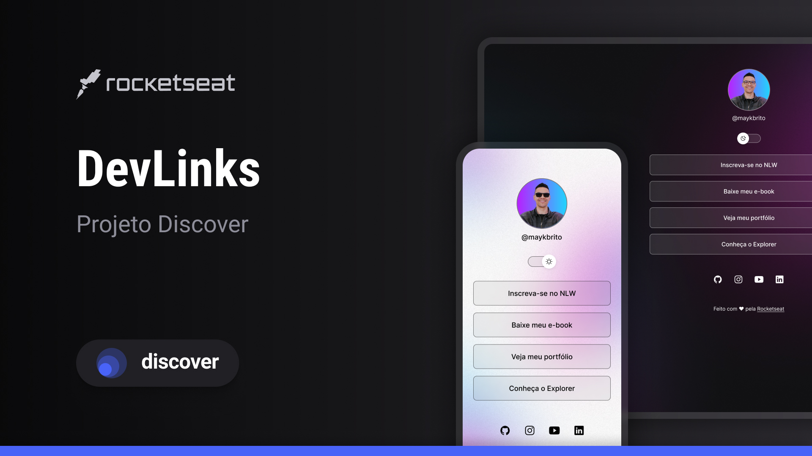

> 🇧🇷 Leia esta documentação em [português](./README.pt.md)

<h1 align="center"> WidneyLinks </h1>

<p align="center">
Exclusive and free program by Rocketseat to teach WEB technologies.
</p>

<p align="center">
  <a href="#-technologies">Technologies</a>&nbsp;&nbsp;&nbsp;|&nbsp;&nbsp;&nbsp;
  <a href="#-project">Project</a>&nbsp;&nbsp;&nbsp;|&nbsp;&nbsp;&nbsp;
  <a href="#-learnings">Learnings</a>&nbsp;&nbsp;&nbsp;|&nbsp;&nbsp;&nbsp;
  <a href="#-layout">Layout</a>&nbsp;&nbsp;&nbsp;|&nbsp;&nbsp;&nbsp;
  <a href="#-how-to-run-this-project">How to run</a>&nbsp;&nbsp;&nbsp;|&nbsp;&nbsp;&nbsp;
  <a href="#memo-license">License</a>
</p>

<p align="center">
  
</p>

<br>

<p align="center">
  
</p>

## 🚀 Technologies

This project was developed using:

- HTML & CSS  
- JavaScript  
- Git & GitHub  
- Figma  

## 💻 Project

DevLinks is a personal link aggregator you can use as an online business card.

## 📘 Learnings

This was my **first real project using HTML, CSS, and JavaScript**, and it marked an important milestone in my journey as a web developer.

With DevLinks, I learned how to:

- Structure semantic HTML;
- Apply and organize CSS styles;
- Add interactivity with vanilla JavaScript;
- Make responsive layouts;
- Use Git for version control and publish with GitHub;
- Follow and implement a Figma design.

I'm proud of the result and motivated to keep improving and building more projects!

## 🔖 Layout

You can view the project's design in [THIS LINK](https://www.figma.com/community/file/1187422022288947321).  
A [Figma](https://figma.com) account is required to access it.

## 💡 How to run this project locally

```bash
# Clone this repository
git clone https://github.com/widneyleme/devlinks.git

# Go into the folder
cd devlinks

# Open the index.html file in your browser
# Or use a Live Server extension if you're using VS Code
