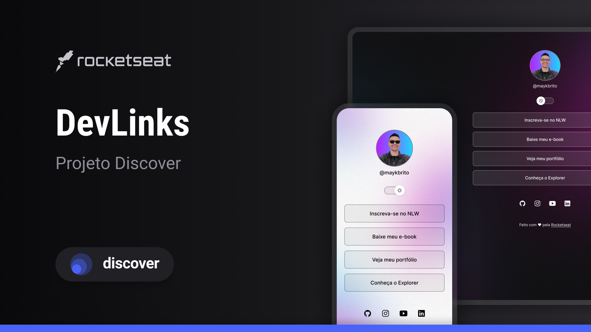

> 🇺🇸 Read this documentation in [English](./README.md)

<h1 align="center"> DevLinks </h1>

<p align="center">
Programa exclusivo e gratuito da Rocketseat para ensinar tecnologias WEB.
</p>

<p align="center">
  <a href="#-tecnologias">Tecnologias</a>&nbsp;&nbsp;&nbsp;|&nbsp;&nbsp;&nbsp;
  <a href="#-projeto">Projeto</a>&nbsp;&nbsp;&nbsp;|&nbsp;&nbsp;&nbsp;
  <a href="#-aprendizados">Aprendizados</a>&nbsp;&nbsp;&nbsp;|&nbsp;&nbsp;&nbsp;
  <a href="#-layout">Layout</a>&nbsp;&nbsp;&nbsp;|&nbsp;&nbsp;&nbsp;
  <a href="#-como-rodar-este-projeto">Como rodar</a>&nbsp;&nbsp;&nbsp;|&nbsp;&nbsp;&nbsp;
  <a href="#memo-licença">Licença</a>
</p>

<p align="center">
  
</p>

<br>

<p align="center">
  
</p>

## 🚀 Tecnologias

Esse projeto foi desenvolvido com as seguintes tecnologias:

- HTML & CSS  
- JavaScript  
- Git & GitHub  
- Figma  

## 💻 Projeto

DevLinks é um agregador de links pessoal que pode ser usado como um cartão de visitas online.

## 📘 Aprendizados

Esse foi meu **primeiro projeto real usando HTML, CSS e JavaScript**, e marcou um passo importante na minha jornada como desenvolvedor web.

Com o DevLinks, aprendi a:

- Estruturar HTML semântico;
- Aplicar e organizar estilos com CSS;
- Adicionar interatividade com JavaScript puro;
- Criar layouts responsivos;
- Utilizar Git para controle de versão e publicar com GitHub;
- Seguir e implementar um layout do Figma.

Estou orgulhoso do resultado e motivado a continuar evoluindo e criando novos projetos!

## 🔖 Layout

Você pode visualizar o design do projeto [NESTE LINK](https://www.figma.com/community/file/1187422022288947321).  
É necessário ter uma conta no [Figma](https://figma.com) para acessá-lo.

## 💡 Como rodar este projeto

```bash
# Clone este repositório
git clone https://github.com/widneyleme/devlinks.git

# Acesse a pasta
cd devlinks

# Abra o arquivo index.html no seu navegador
# Ou use a extensão Live Server, se estiver utilizando o VS Code
